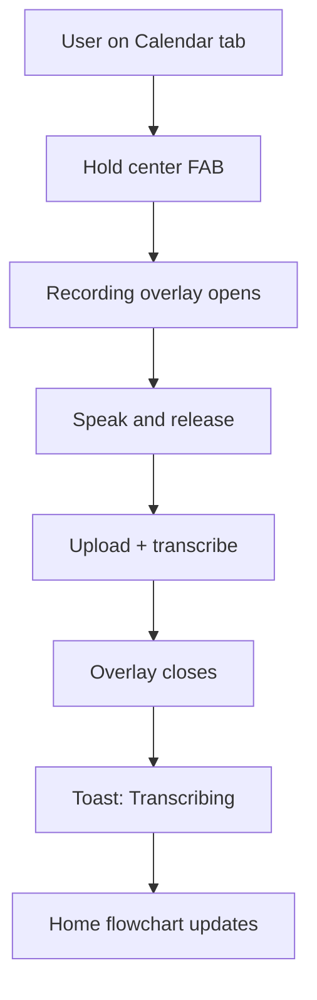
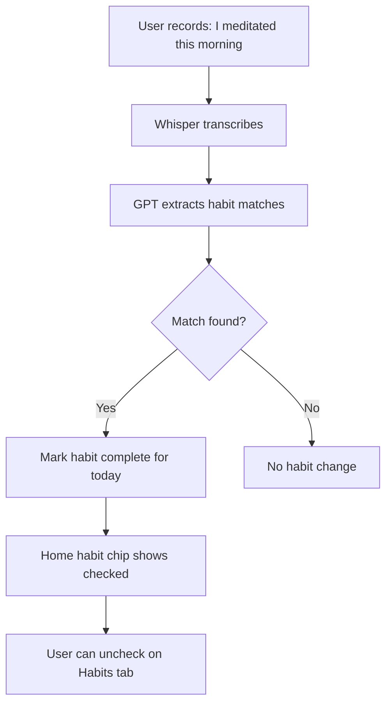
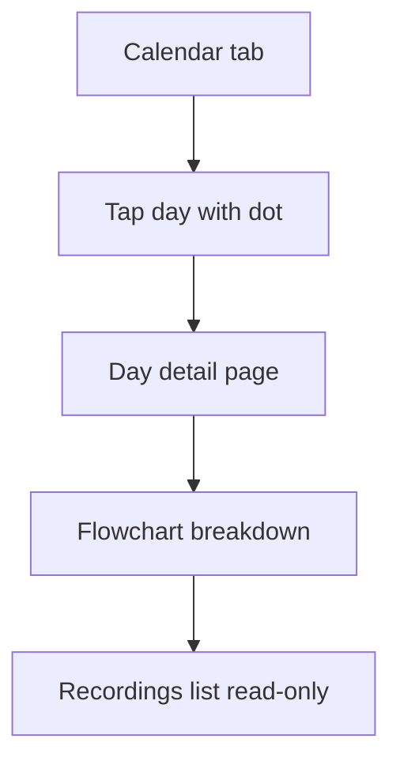

# Product Requirements Document (PRD)
# FIRNAL — Voice-First AI Journaling App

**Version:** 2.4  
**Date:** September 6, 2026  
**Status:** Draft — Ready for implementation  
**Author:** Product / Engineering  

---

## Table of Contents

1. [Executive Summary](#1-executive-summary)
2. [Problem & Opportunity](#2-problem--opportunity)
3. [Product Vision & Goals](#3-product-vision--goals)
4. [Target Users](#4-target-users)
5. [Scope Definition](#5-scope-definition)
6. [Information Architecture & Navigation](#6-information-architecture--navigation)
7. [User Stories & Acceptance Criteria](#7-user-stories--acceptance-criteria)
8. [User Flows](#8-user-flows)
9. [Feature Specifications](#9-feature-specifications)
10. [Home Flowchart UI (Reference Design)](#10-home-flowchart-ui-reference-design)
11. [AI Pipeline Specification](#11-ai-pipeline-specification)
12. [Data Model & API Design](#12-data-model--api-design)
13. [UI/UX Requirements](#13-uiux-requirements)
14. [Technical Architecture](#14-technical-architecture)
15. [Non-Functional Requirements](#15-non-functional-requirements)
16. [Step-by-Step Implementation Plan](#16-step-by-step-implementation-plan)
17. [Testing Plan](#17-testing-plan)
18. [Launch Checklist](#18-launch-checklist)
19. [Risks & Mitigations](#19-risks--mitigations)
20. [Future Roadmap (Post-MVP)](#20-future-roadmap-post-mvp)
21. [Open Questions](#21-open-questions)
22. [Competitive Analysis: Structured](#22-competitive-analysis-structured)

**Appendices**
- [Appendix A: Glossary](#appendix-a-glossary)
- [Appendix B: Build Plan Master Index](#appendix-b-build-plan-master-index)

---

## 1. Executive Summary

**FIRNAL** is a voice-first AI journaling Progressive Web App (PWA). Users capture thoughts throughout the day by holding a center record button and speaking freely. An AI agent transcribes each capture, merges all of a day's notes into a **flowchart-style daily breakdown** (Commitments, Decisions, Ideas, People, Questions), tracks habits mentioned in voice, and surfaces Google Calendar events alongside the day overview.

The core value proposition: **record your day in seconds; read a structured, visual journal without spending time writing.**

**Positioning vs. Structured (Daily Planner):** Structured helps you *plan and execute* the day ahead; FIRNAL helps you *remember and make sense of* the day past. We borrow Structured's navigation and visual clarity, but stay voice-first and reflection-first — closer to "automatic memory" than "daily planner."

**Target tagline (draft):** *"Ramble for 30 seconds. Your whole day, organized."*

### Confirmed MVP Decisions (v2.1)

| Decision | Choice |
|----------|--------|
| Platform | Web PWA (desktop + mobile browser) |
| Capture model | Multiple voice captures per day → one merged daily flowchart |
| Authentication | **Phase 9** — email magic-link + cloud sync (Phases 0–8: no sign-in wall; data in localStorage) |
| Navigation | 4 tabs + center record button: Home, Calendar, Habits, Profile |
| Home breakdown | Whole-day merged flowchart (5 AI categories + connector lines) |
| Habits | AI auto-check when mentioned in voice + manual toggle on Habits tab |
| Google Calendar | MVP: read-only — show today's events on Home and Profile connect flow |
| Search | Available from Home header (not a separate tab) |
| Future widget | iOS + Android home-screen record widget (requires native wrapper phase) |

### Design References

| Reference | What we take from it |
|-----------|---------------------|
| **"One ramble, five kinds of thing" mockup** | Flowchart layout: merged transcript on left, 5 categorized columns on right, colored highlight spans, curved connector lines — FIRNAL's signature visual |
| **Hand-drawn wireframe** | Bottom nav with elevated center mic button; Home = day overview + recent recordings + habits |
| **[Structured](https://structured.app/) — Daily Planner Todo** | Center add button + bottom tabs; capture-first inbox model; day/week/month lenses; calendar + habits in one day context; soft color-coded cards; widgets/Live Activities (see Section 22) |

---

## 2. Problem & Opportunity

### Problem

- Inspiration, reflections, and important thoughts strike at random times but are lost because recording them is too much effort.
- Traditional journaling requires dedicated time, blank-page anxiety, and manual organization.
- Habit tracking and journaling live in separate apps — voice mentions ("I went for a run") don't connect to habit logs.
- Calendar context (meetings, blocks) is disconnected from reflective capture.

### Opportunity

A single app that collapses **capture → transcribe → categorize → habit-track → review** into one seamless flow. Users speak; the AI structures their day visually.

---

## 3. Product Vision & Goals

### Vision

Make daily reflection effortless so people actually keep a journal — and can look back on their lives with clarity, habits, and context. Over time, bridge reflection to light action (commitments, habit progress) without becoming a full planner.

### Strategic Principles (from Structured analysis)

1. **One visual hero per screen** — Home = flowchart; Calendar = month grid; never a blank page
2. **Capture first, structure later** — user never tags or categorizes manually
3. **Multiple time lenses** — day (Home), month (Calendar); week view planned for v1.4
4. **Actionable output** — journal should not feel passive; surface Commitments and open Questions as gentle next steps (v1.2+)
5. **Glanceable access** — center FAB in MVP; widgets + Live Activities in native phase (v2.0)
6. **Stay in lane** — do not compete head-on with Structured on forward planning, replan, or time-blocking

### MVP Goals

| Goal | Metric (MVP target) |
|------|---------------------|
| Fast capture | Time from open app to recording < 3 seconds (record button always visible) |
| Low effort | Average user spends < 2 min/day actively in app |
| Useful output | User sees coherent 5-category flowchart after 1+ captures |
| Habit signal | Voice mention of habit completion auto-checks ≥ 80% accuracy (manual override available) |
| Retention signal | User returns and captures on 3+ days in first week |
| Searchability | User can find a past entry by keyword within 2 seconds |

### Non-Goals (MVP)

- Write events back to Google Calendar
- Morning briefing / push notifications
- Per-recording individual flowchart view (whole-day merge only for MVP)
- Home-screen record widget (future — see Section 20)
- Native iOS/Android apps (future)
- Subscription / payments
- Team or shared journals

---

## 4. Target Users

### Primary Persona: The Busy Professional

- **Who:** Founders, consultants, knowledge workers with many loose thoughts and commitments
- **Behavior:** Thinks out loud; rarely sits down to write; juggles calendar + habits + notes
- **Need:** Capture without friction; see commitments/decisions/people at a glance
- **Device:** Primarily phone browser; occasionally desktop

### Secondary Persona: The Casual Reflector

- **Who:** Anyone who wants to journal or build habits but can't stick with it
- **Behavior:** Opens app once or twice a day for 30–60 second rambles
- **Need:** Fun, low-pressure way to remember good moments and track simple daily habits

---

## 5. Scope Definition

### In Scope (MVP — Phases 0–7, no sign-in)

1. **Local-first data** — voice captures in `localStorage` until Phase 9
2. **Center FAB record button** — hold-to-record from any tab (opens recording overlay)
3. Multiple voice captures per day
4. Speech-to-text transcription (OpenAI Whisper)
5. **Whole-day flowchart breakdown** — 5 categories with visual connectors
6. **Home tab** — day flowchart, recent recordings, habit reminders, Google Calendar events (read)
7. **Calendar tab** — month view archive of journaled days
8. **Habits tab** — create daily habits, AI auto-complete from voice, manual toggle
9. **Profile tab** — Google Calendar connect (read), timezone, account settings *(sign-in → Phase 9)*
10. Full-text search (from Home header)
11. PWA installability
12. Timezone-aware day grouping

### Out of Scope (MVP)

- Record-from-widget (future native phase)
- Google Calendar write/sync of commitments
- Per-recording flowchart drill-down
- Audio playback of recordings
- Edit/delete individual captures
- Weekly/custom habit schedules (daily habits only for MVP)
- Habit streaks and analytics
- Export to PDF/Markdown
- Offline recording
- Multi-language UI
- Dark mode

---

## 6. Information Architecture & Navigation

### 6.1 Bottom Navigation Bar

The primary navigation is a **5-slot bottom bar** with an elevated center record button, matching the wireframe reference:

```
┌─────────────────────────────────────────────┐
│                                             │
│              (Tab content)                  │
│                                             │
├──────────┬──────────┬──────────┬──────────┤
│   Home   │ Calendar │  🎙️ MIC  │  Habits  │  Profile  │
│    🏠    │    📅    │  (FAB)   │    ✓     │    👤     │
└──────────┴──────────┴──────────┴──────────┴───────────┘
                          ↑
              Elevated, larger, always tappable
              Hold to record from ANY tab
```

| Tab | Route | Purpose |
|-----|-------|---------|
| **Home** | `/` | Ongoing day overview (flowchart), recent recordings, habit reminders, calendar events |
| **Calendar** | `/calendar` | Month grid archive of past journaled days |
| **Record (FAB)** | overlay | Hold-to-record; not a route — opens `RecordingOverlay` modal |
| **Habits** | `/habits` | Add/edit daily habits; view today's completion status |
| **Profile** | `/profile` | Google Calendar connect, email, timezone, sign out |

### 6.2 Recording Overlay

When the user holds the center FAB from any tab:

1. Semi-transparent overlay dims the current screen
2. Large pulsing record indicator + elapsed timer
3. Release → upload → dismiss overlay → toast "Transcribing…"
4. Home tab data refreshes when processing completes

### 6.3 Search Placement

Search is **not a bottom tab**. A search icon in the Home header opens `/search` as a full-screen overlay or sub-page.

---

## 7. User Stories & Acceptance Criteria

### Epic 1: Authentication *(Phase 9)*

**US-1.1** — Sign in with email magic link.

- [ ] Deferred to Phase 9 — `/login` sends magic link; callback lands on Home
- [ ] Invalid/expired links show clear error + retry
- [ ] Session persists across browser restarts; local data migrates on first login

---

### Epic 2: Voice Capture (Center FAB)

**US-2.1** — Hold center button to record from any tab.

- [ ] FAB is always visible in bottom nav
- [ ] Hold starts recording; release stops and uploads
- [ ] Visual feedback: pulse ring, timer, uploading state
- [ ] Min 1s / max 180s per capture

**US-2.2** — Multiple captures per day merge into one flowchart.

- [ ] Each capture appears in Home "Recent Recordings"
- [ ] All captures for the day feed the merged flowchart

**US-2.3** — Mic permission errors handled gracefully.

- [ ] Clear instructions if permission denied

---

### Epic 3: AI Flowchart Breakdown

**US-3.1** — Voice transcribed automatically.

- [ ] Transcript in Recent Recordings within ~10s
- [ ] Retry on failure

**US-3.2** — Whole-day merged into 5-category flowchart.

- [ ] Categories: Commitments, Decisions, Ideas, People, Questions
- [ ] Colored highlights in merged transcript map to categories
- [ ] Curved connector lines from highlights to category cards (desktop/tablet)
- [ ] Regenerates after new capture (30s debounce)
- [ ] Does not invent facts

**US-3.3** — Day title and summary shown above flowchart.

- [ ] Short evocative title + 1–2 sentence summary

---

### Epic 4: Home Tab

**US-4.1** — See today's flowchart overview.

- [ ] Flowchart is the hero section on Home
- [ ] Empty state: "Hold the mic and tell me about your day"

**US-4.2** — See recent recordings list.

- [ ] Last 5 captures today with time + transcript preview
- [ ] "View all" expands full list

**US-4.3** — See habit reminders on Home.

- [ ] Incomplete habits for today shown as checklist chips
- [ ] Completed habits show checkmark (auto or manual)

**US-4.4** — See Google Calendar events on Home (if connected).

- [ ] Today's events listed in compact timeline strip
- [ ] Empty/disconnected state: "Connect Google Calendar in Profile"

**US-4.5** — Search from Home header.

- [ ] Search icon opens search with full-text results

---

### Epic 5: Calendar Tab

**US-5.1** — Browse past journaled days on a calendar.

- [ ] Month grid with dots/indicators on days with entries
- [ ] Tap day → day detail with flowchart + recordings
- [ ] Swipe/navigate between months

**US-5.2** — Days without journal entries are visually muted.

- [ ] No dot on empty days; not tappable

---

### Epic 6: Habits Tab

**US-6.1** — Create daily habits.

- [ ] Add habit with name + optional emoji/icon
- [ ] Daily frequency only (MVP)
- [ ] Edit name; archive/delete habit

**US-6.2** — AI auto-completes habits mentioned in voice.

- [ ] Saying "I went for a run" checks off "Exercise" habit
- [ ] Completion source tagged: `voice` or `manual`
- [ ] User can uncheck manually on Habits tab

**US-6.3** — Manual toggle on Habits tab.

- [ ] Tap habit row to check/uncheck for today
- [ ] Overrides voice detection if needed

---

### Epic 7: Profile Tab

**US-7.1** — Connect Google Calendar (read-only).

- [ ] "Connect Google Calendar" OAuth button
- [ ] Shows connected account email + disconnect option
- [ ] Read today's events for Home tab

**US-7.2** — Account settings.

- [ ] Display email, timezone
- [ ] Sign out

---

### Epic 8: PWA

**US-8.1** — Installable on home screen.

- [ ] Valid manifest, icons, standalone display mode

---

## 8. User Flows

### Flow A: Record from Calendar tab



### Flow B: Habit auto-complete via voice



### Flow C: Browse past day



---

## 9. Feature Specifications

### 9.1 Center FAB Record Button

| Attribute | Specification |
|-----------|---------------|
| Placement | Center of bottom nav, elevated 8–12px above bar |
| Size | 64×64px minimum touch target |
| Interaction | Hold to record; release to stop |
| Availability | All authenticated tabs |
| Visual | Mic icon idle; pulsing red/rose ring when recording |
| Overlay | Full-screen dim + large timer |

### 9.2 Home Tab Layout (top → bottom)

| Section | Specification |
|---------|---------------|
| Header | Date ("Tuesday, Sep 6"), search icon |
| Day title + summary | AI-generated, 1–2 lines |
| **Flowchart** | Hero — see Section 10 |
| Habit reminders | Horizontal scroll chips; incomplete first |
| Calendar events | Compact list if Google connected (time + title) — provides *when* context alongside flowchart's *what* context (Structured-inspired) |
| Recent recordings | Last 5 captures; timestamp + preview |
| Future (v1.2) | Action chips on Commitments + open Questions — addresses "passive journal" risk (see Section 22.4) |

### 9.3 Calendar Tab

| Attribute | Specification |
|-----------|---------------|
| View | Month grid (Structure-inspired clean cells) |
| Indicators | Filled dot on days with `daily_journals` |
| Today | Ring highlight on current date |
| Tap day | Navigate to `/calendar/[date]` |
| Empty month | "No entries this month" |

### 9.4 Habits Tab

| Attribute | Specification |
|-----------|---------------|
| List | All active daily habits |
| Row | Emoji/icon, name, today's checkbox |
| Add | FAB or "+ Add habit" → modal (name, emoji picker) |
| Completion badge | Small "via voice" label when AI-checked |
| Empty | "Add a habit to track daily" |

### 9.5 Profile Tab

| Section | Content |
|---------|---------|
| Google Calendar | Connect / Connected status / Disconnect |
| Account | Email, timezone |
| Actions | Sign out |
| Future | Placeholder card: "Record from widget — coming soon" (Structured has widgets/Live Activities; FIRNAL v2.0) |

### 9.6 Search

| Attribute | Specification |
|-----------|---------------|
| Entry | Home header search icon |
| Min query | 2 characters |
| Results | Date, title, snippet with highlight |
| Tap | Navigate to day detail |

---

## 10. Home Flowchart UI (Reference Design)

This is the signature UI element, inspired by the **"One ramble, five kinds of thing"** reference.

### 10.1 Layout (Desktop / Tablet ≥ 768px)

```
┌─────────────────────────────┬──────────────────────────────────────────┐
│  MERGED TRANSCRIPT          │  COMMITMENTS │ DECISIONS │ IDEAS │ ...  │
│  ─────────────────          │  ────────────┼───────────┼───────┼────  │
│  Tuesday · 3 captures       │  [card]      │ [card]    │[card] │      │
│                             │              │           │       │      │
│  "Met with Priya about      │  PEOPLE      │ QUESTIONS │       │      │
│   the deck…"  ←orange span   │  [P Priya]   │ [card]    │       │      │
│                             │  [T Tom]     │ [card]    │       │      │
│  (curved connector lines    │              │           │       │      │
│   from colored spans →      │              │           │       │      │
│   matching category cards)  │              │           │       │      │
└─────────────────────────────┴──────────────────────────────────────────┘
```

### 10.2 Layout (Mobile < 768px)

Mobile stacks vertically — full flowchart with side-by-side columns doesn't fit:

1. **Merged transcript card** — scrollable, colored inline highlights
2. **Category grid** — 2×3 grid of category cards (5 categories + summary)
3. Connector lines simplified to **color-coded left borders** on cards matching highlight colors

### 10.3 Category Colors

| Category | Color | Hex (guidance) |
|----------|-------|----------------|
| Commitments | Orange | `#F97316` |
| Decisions | Green | `#22C55E` |
| Ideas | Blue | `#3B82F6` |
| People | Gray/Slate | `#64748B` |
| Questions | Pink | `#EC4899` |

### 10.4 Category Card Content

| Category | Card format |
|----------|-------------|
| Commitments | Action item text (e.g. "Send Priya the revised deck, Friday") |
| Decisions | Past-tense resolution (e.g. "Accepted the delay on Priya's project") |
| Ideas | Idea phrase (e.g. "Bundle the audit into pricing") |
| People | Avatar circle + initial + name |
| Questions | Unresolved question text |

### 10.5 Transcript Highlights

GPT returns `spans` mapping character ranges in merged transcript to categories:

```typescript
interface TranscriptSpan {
  start: number;
  end: number;
  category: 'commitments' | 'decisions' | 'ideas' | 'people' | 'questions';
  label?: string; // for people names
}
```

Frontend renders `<mark style="background: categoryColor">` for each span. SVG `<path>` elements draw curved connectors from span midpoint to corresponding card (desktop only).

### 10.6 Footer Caption

Below flowchart (subtle, italic):

> "You didn't tag anything, name anything, or decide where any of it goes."

---

## 11. AI Pipeline Specification

### 11.1 Transcription (Whisper)

Unchanged from v1.0 — per capture, store transcript, trigger downstream processing.

**After transcription, also trigger:**
- Daily flowchart regeneration (debounced)
- Habit completion detection (see 11.3)

### 11.2 Daily Flowchart (GPT-4o-mini)

**Input:** All transcripts for calendar day + user's active habit names (for cross-reference)

**Output JSON Schema:**

```typescript
interface DailyFlowchart {
  title: string;
  summary: string;
  mergedTranscript: string;  // cleaned, deduplicated narrative
  spans: TranscriptSpan[];   // highlight mappings
  commitments: string[];
  decisions: string[];
  ideas: string[];
  people: { name: string; initial: string }[];
  questions: string[];
  mood?: string;
}
```

**System prompt (key rules):**
- Merge all captures into one coherent `mergedTranscript`
- Extract items into exactly 5 categories
- Return `spans` with character offsets into `mergedTranscript`
- Do NOT invent facts
- Deduplicate across captures
- People: extract names mentioned; generate single-letter initial

### 11.3 Habit Detection (GPT-4o-mini)

Run in same API call or immediately after flowchart generation.

**Input:** New transcript + list of user's habit names  
**Output:**

```typescript
interface HabitDetection {
  completedHabitIds: string[];
  confidence: 'high' | 'medium';
}
```

**Rules:**
- Only mark complete on explicit or strongly implied completion ("I went for a run" → Exercise)
- Do not mark on intent alone ("I should meditate" ≠ complete)
- On `medium` confidence, still auto-check (user can uncheck manually)

### 11.4 Cost Estimates

| Usage | Est. monthly/user |
|-------|-------------------|
| 3 captures/day + flowchart + habits | ~$0.30/month |
| 5 captures/day | ~$0.55/month |

---

## 12. Data Model & API Design

### 12.1 Database Schema

#### `profiles`

```sql
CREATE TABLE profiles (
  id UUID PRIMARY KEY REFERENCES auth.users(id) ON DELETE CASCADE,
  email TEXT NOT NULL,
  timezone TEXT NOT NULL DEFAULT 'UTC',
  google_calendar_connected BOOLEAN DEFAULT false,
  google_refresh_token TEXT,  -- encrypted at rest via Supabase vault or app-level encryption
  created_at TIMESTAMPTZ NOT NULL DEFAULT now(),
  updated_at TIMESTAMPTZ NOT NULL DEFAULT now()
);
```

#### `voice_entries` — unchanged from v1.0

#### `daily_journals`

```sql
CREATE TABLE daily_journals (
  id UUID PRIMARY KEY DEFAULT gen_random_uuid(),
  user_id UUID NOT NULL REFERENCES auth.users(id) ON DELETE CASCADE,
  journal_date DATE NOT NULL,
  structured JSONB NOT NULL,  -- DailyFlowchart schema
  generated_at TIMESTAMPTZ NOT NULL DEFAULT now(),
  UNIQUE(user_id, journal_date)
);
```

#### `habits`

```sql
CREATE TABLE habits (
  id UUID PRIMARY KEY DEFAULT gen_random_uuid(),
  user_id UUID NOT NULL REFERENCES auth.users(id) ON DELETE CASCADE,
  name TEXT NOT NULL,
  emoji TEXT DEFAULT '✓',
  is_active BOOLEAN DEFAULT true,
  created_at TIMESTAMPTZ NOT NULL DEFAULT now()
);
```

#### `habit_completions`

```sql
CREATE TABLE habit_completions (
  id UUID PRIMARY KEY DEFAULT gen_random_uuid(),
  habit_id UUID NOT NULL REFERENCES habits(id) ON DELETE CASCADE,
  user_id UUID NOT NULL REFERENCES auth.users(id) ON DELETE CASCADE,
  completion_date DATE NOT NULL,
  source TEXT NOT NULL CHECK (source IN ('voice', 'manual')),
  voice_entry_id UUID REFERENCES voice_entries(id),
  created_at TIMESTAMPTZ NOT NULL DEFAULT now(),
  UNIQUE(habit_id, completion_date)
);
```

### 12.2 New API Routes

| Method | Route | Purpose |
|--------|-------|---------|
| GET | `/api/habits` | List active habits + today's completion status |
| POST | `/api/habits` | Create habit |
| PATCH | `/api/habits/[id]` | Update/archive habit |
| POST | `/api/habits/[id]/toggle` | Manual check/uncheck for today |
| GET | `/api/calendar/events` | Fetch today's Google Calendar events |
| GET | `/api/auth/google` | Start Google OAuth |
| GET | `/api/auth/google/callback` | OAuth callback, store refresh token |
| DELETE | `/api/auth/google` | Disconnect Google Calendar |
| GET | `/api/calendar/month?year=&month=` | Days with journal entries for month grid |

Existing routes retained: `/api/transcribe`, `/api/journal/[date]`, `/api/search`

### 12.3 Google Calendar Integration (Read-Only MVP)

- OAuth 2.0 scopes: `https://www.googleapis.com/auth/calendar.readonly`
- Store refresh token encrypted in `profiles`
- Fetch events for today on Home load (cache 15 min)
- Display: time, title, calendar color dot

---

## 13. UI/UX Requirements

### 13.1 Design Principles

1. **Voice is always one tap away** — center FAB on every screen (validated by Structured's centered add button)
2. **Visual structure over walls of text** — flowchart is the hero, not a timeline (FIRNAL's differentiated metaphor)
3. **Planner calm** — Structured-inspired: soft pastels, generous whitespace, scannable cards, minimal floating chrome
4. **Zero blank pages** — no empty textareas ever; empty Home shows inviting prompt, not a form
5. **Mobile-first** — thumb zone optimized; FAB centered for one-handed use
6. **Time + meaning together** — calendar events strip gives *when* context; flowchart gives *what kind of thing* context
7. **Capture now, organize later** — Structured's Inbox pattern adapted for voice rambles

### 13.2 Patterns Borrowed from Structured

| Structured pattern | FIRNAL adaptation |
|--------------------|-------------------|
| Center add button in bottom tab bar | Center mic FAB — hold to record |
| Visual day timeline | Semantic day flowchart (5 categories) |
| Month grid → tap day for detail | Calendar tab with journal dots → day detail |
| Inbox: capture fast, sort later | Voice ramble → AI sorts into categories |
| Color-coded tasks with icons | Color-coded category columns + habit emoji chips |
| Calendar sync for day context | Google Calendar read on Home (MVP) |
| Widgets + Live Activities | Future native phase (v2.0) |
| AI creates/edits tasks | AI extracts journal structure + habit completions |
| Week view for planning | Week view for reflection patterns (v1.4) |

### 13.3 Patterns We Deliberately Avoid

| Structured feature | Why FIRNAL skips (MVP) |
|--------------------|------------------------|
| Drag-and-drop time blocking | Forward-looking planner, not our core job |
| Replan / auto-reschedule missed tasks | Execution tool, not reflection tool |
| Pomodoro / focus timer | Out of scope |
| Full calendar write-back | Deferred to v1.2; read-only first |

### 13.4 Visual Style

| Element | Guidance |
|---------|----------|
| Background | Warm off-white `#FAF9F6` (cream, matching reference mockup) |
| Cards | White, subtle shadow, rounded-xl |
| FAB | Rose/red `#E11D48`, elevated with shadow |
| Typography | Inter or system sans; 16px base |
| Category colors | See Section 10.3 |

### 13.5 Screen Inventory

| Route | Screen |
|-------|--------|
| `/login` | Magic link login |
| `/` | Home tab |
| `/calendar` | Calendar tab (month grid) |
| `/calendar/[date]` | Day detail |
| `/habits` | Habits tab |
| `/profile` | Profile tab |
| `/search` | Search (from Home) |
| `/auth/callback` | Supabase auth callback |

### 13.6 Component Inventory

```
components/
├── navigation/
│   ├── BottomNav.tsx           # 4 tabs + center FAB slot
│   └── RecordingOverlay.tsx    # Full-screen record UI
├── home/
│   ├── DayFlowchart.tsx        # Transcript + 5 categories + connectors
│   ├── TranscriptPanel.tsx     # Left panel with highlights
│   ├── CategoryColumn.tsx      # Single category column
│   ├── ConnectorLines.tsx      # SVG curved lines (desktop)
│   ├── HabitReminders.tsx      # Horizontal habit chips
│   ├── CalendarEventsStrip.tsx # Today's Google events
│   └── RecentRecordings.tsx
├── calendar/
│   ├── MonthGrid.tsx
│   └── DayCell.tsx
├── habits/
│   ├── HabitList.tsx
│   ├── HabitRow.tsx
│   └── AddHabitModal.tsx
├── profile/
│   ├── GoogleCalendarConnect.tsx
│   └── AccountSettings.tsx
└── search/
    ├── SearchBar.tsx
    └── SearchResults.tsx
```

---

## 14. Technical Architecture

### 14.1 Stack

| Layer | Technology |
|-------|------------|
| Frontend | Next.js 15, React 19, TypeScript |
| Styling | Tailwind CSS 4, shadcn/ui |
| Auth + DB | Supabase |
| AI | OpenAI Whisper + GPT-4o-mini |
| Google | Google Calendar API v3, OAuth 2.0 |
| PWA | @serwist/next |
| Deploy | Vercel + Supabase |

### 14.2 System Architecture

```mermaid
flowchart TB
    subgraph client [Client PWA]
        BottomNav[BottomNav + FAB]
        Flowchart[DayFlowchart]
        MR[MediaRecorder]
    end

    subgraph vercel [Vercel API]
        Transcribe[/api/transcribe]
        Journal[/api/journal]
        Habits[/api/habits]
        Google[/api/auth/google]
    end

    subgraph external [External]
        Whisper[OpenAI Whisper]
        GPT[OpenAI GPT]
        GCal[Google Calendar API]
    end

    subgraph supabase [Supabase]
        DB[(PostgreSQL)]
        Auth[Magic Link Auth]
    end

    BottomNav --> MR
    MR --> Transcribe
    Transcribe --> Whisper
    Transcribe --> Journal
    Journal --> GPT
    Journal --> DB
    Habits --> DB
    Google --> GCal
    Flowchart --> Journal
```

### 14.3 Environment Variables (additions)

```bash
GOOGLE_CLIENT_ID=
GOOGLE_CLIENT_SECRET=
GOOGLE_REDIRECT_URI=http://localhost:3000/api/auth/google/callback
```

---

## 15. Non-Functional Requirements

| Category | Requirement |
|----------|-------------|
| Performance | Home LCP < 2.5s; flowchart render < 100ms after data load |
| FAB response | Recording starts < 500ms after hold |
| Transcription | P95 < 15s for 60s audio |
| Flowchart generation | P95 < 12s |
| Security | RLS on all tables; Google tokens encrypted; OAuth state CSRF protection |
| Accessibility | FAB aria-label "Hold to record"; category cards have semantic headings |
| Mobile | Safe-area-inset for bottom nav; FAB ≥ 64px |

---

## 16. Step-by-Step Implementation Plan

Each phase is broken into **baby steps** — small, verifiable tasks completed in order. Check off each step before moving to the next unless noted as parallel-safe.

**Phase exit criteria** are listed at the end of each phase.

### 16.0 Build Plan at a Glance

**9 phases · Phases 0–8 ship without sign-in · Phase 9 adds auth + cloud sync**

| Phase | Steps | Days | Focus | Exit criteria (must pass before next phase) |
|-------|-------|------|-------|---------------------------------------------|
| **0** | 9 | 1 | Project setup | `npm run dev` works; shadcn renders; env template ready |
| **1** | 10 | 2–4 | Nav shell (no auth) | 4 tabs + FAB shell; overlay opens/closes |
| **2** | 10 | 5–7 | Voice capture | Hold FAB → transcript on Home (localStorage); OpenAI key |
| **3** | 12 | 8–11 | Flowchart AI | Merged 5-category flowchart; highlights + desktop connectors |
| **4** | 9 | 12–14 | Habits | Create habit; voice auto-check; manual toggle; Home chips |
| **5** | 8 | 15–17 | Calendar + search | Month dots; day detail; keyword search finds past entry |
| **6** | 10 | 18–20 | Google + Profile | OAuth connect; today's events on Home; Profile complete |
| **7** | 11 | 21–23 | PWA + launch | Installable PWA; deployed; smoke tests pass |
| **9** | 10 | 24–26 | **Auth + cloud sync** | Magic link login; middleware; migrate local → Supabase |

**How to use this plan**
1. Work phases in order (0 → 7, then **9** before production if cloud sync required).
2. Phases **2–8** use **localStorage** for journal data — no sign-in required.
3. Complete every checkbox in a step before marking the step done.
4. See [Appendix B](#appendix-b-build-plan-master-index) for step index.

**Example flow (Phase 2 — Voice):**
```
2.1 useMediaRecorder hook → 2.2 Wire overlay → 2.3 Mic errors → 2.4 uploadCapture
→ 2.5 /api/transcribe → 2.6 OpenAI client → 2.7 Timezone helpers
→ 2.8 RecentRecordings → 2.9 End-to-end upload → 2.10 Home integration
→ ✅ Exit: 3 captures, transcripts on Home, retry works
```

---

### Phase 0: Project Setup (Day 1)

**Goal:** Empty repo runs locally with tooling configured.

#### 0.1 — Initialize Next.js project
- [ ] Run `npx create-next-app@latest` with TypeScript, App Router, Tailwind, ESLint, `src/` dir optional (use `app/` at root per PRD)
- [ ] Verify `npm run dev` serves `localhost:3000`
- [ ] Delete default boilerplate content from `app/page.tsx`

#### 0.2 — Configure code quality tooling
- [ ] Add Prettier config (`.prettierrc`) matching project defaults (single quotes, semi, 2-space indent)
- [ ] Add `.prettierignore` (`.next`, `node_modules`)
- [ ] Confirm ESLint runs with `npm run lint`

#### 0.3 — Install core dependencies
- [ ] `@supabase/supabase-js`, `@supabase/ssr`
- [ ] `openai`
- [ ] `zod`
- [ ] `date-fns` or `dayjs` (timezone date helpers)
- [ ] `clsx`, `tailwind-merge` (for shadcn)

#### 0.4 — Set up shadcn/ui
- [ ] Run `npx shadcn@latest init` (New York style, zinc base, CSS variables)
- [ ] Add components: `button`, `input`, `card`, `skeleton`, `toast`, `dialog`, `checkbox`, `sonner` (or toast)
- [ ] Verify a test Button renders on home page

#### 0.5 — Configure Tailwind theme tokens
- [ ] Add cream background `#FAF9F6` as `background` token
- [ ] Add category colors (commitments, decisions, ideas, people, questions) to `tailwind.config`
- [ ] Add FAB rose color `#E11D48` as `primary` or custom `fab` token

#### 0.6 — Create environment template
- [ ] Create `.env.local.example` with all vars from Section 14.4
- [ ] Create `.env.local` (gitignored) for local dev
- [ ] Add env validation stub in `lib/env.ts` using Zod (fail fast on missing server vars)

#### 0.7 — Initialize git & README
- [ ] Run `git init`
- [ ] Update `README.md` with project name, one-line description, setup steps (install, env, dev)
- [ ] Verify `.gitignore` includes `.env.local`, `.next`, `node_modules`

#### 0.8 — Create Supabase project (cloud)
- [ ] Create project at supabase.com
- [ ] Copy `NEXT_PUBLIC_SUPABASE_URL` and `NEXT_PUBLIC_SUPABASE_ANON_KEY` to `.env.local`
- [ ] Copy `SUPABASE_SERVICE_ROLE_KEY` to `.env.local` (never expose to client)
- [ ] Enable Email auth provider in Supabase dashboard
- [ ] Set Site URL: `http://localhost:3000`
- [ ] Add redirect URL: `http://localhost:3000/auth/callback`

#### 0.9 — Stub folder structure
- [ ] Create empty dirs/files per Section 14.3: `components/navigation/`, `components/home/`, `lib/supabase/`, `supabase/migrations/`
- [ ] Add placeholder `lib/supabase/client.ts` and `lib/supabase/server.ts` (empty exports)

**Phase 0 exit criteria:** `npm run dev` works; shadcn Button renders; Supabase project exists; `.env.local.example` complete.

---

### Phase 1: Navigation Shell (Days 2–4)

**Goal:** App shell with 4 tabs + FAB visible; no sign-in required. *(Auth → [Phase 9](#phase-9-auth--cloud-sync-days-2426).)*

#### 1.1 — Database migration SQL (prep for Phase 9)
- [ ] Create `supabase/migrations/001_init.sql` — profiles, voice_entries, daily_journals, habits, RLS
- [ ] **Do not require** running migration until Phase 9

#### 1.2 — Supabase client helpers (prep for Phase 9)
- [ ] Implement `lib/supabase/client.ts`, `server.ts`, `middleware.ts` stubs

#### 1.3 — ~~Auth middleware~~ → **Phase 9**
- [ ] No login redirect; app open on first visit

#### 1.4 — Login placeholder → **Phase 9**
- [ ] `/login` shows "Phase 9" message + link to app

#### 1.5 — ~~Auth callback~~ → **Phase 9**

#### 1.6 — Browser timezone
- [ ] `lib/timezone.ts` — used on Home/Profile (no Supabase upsert until Phase 9)

#### 1.7 — App layout with bottom nav
- [ ] Create `app/(app)/layout.tsx` — layout wrapper (no auth gate)
- [ ] Create `components/navigation/BottomNav.tsx`:
  - [ ] 4 tab links: Home, Calendar, Habits, Profile
  - [ ] Center slot for FAB (placeholder circle, no recording yet)
  - [ ] Active tab highlight state
  - [ ] `safe-area-inset-bottom` padding for mobile
- [ ] Move authenticated pages under `app/(app)/` route group

#### 1.8 — Empty tab pages
- [ ] `app/(app)/page.tsx` — Home placeholder ("Home — coming soon")
- [ ] `app/(app)/calendar/page.tsx` — Calendar placeholder
- [ ] `app/(app)/habits/page.tsx` — Habits placeholder
- [ ] `app/(app)/profile/page.tsx` — Profile placeholder (sign-in in Phase 9)

#### 1.9 — ~~Sign out~~ → **Phase 9**

#### 1.10 — RecordingOverlay shell
- [ ] Create `components/navigation/RecordingOverlay.tsx`
- [ ] Props: `isOpen`, `onClose`, `status: 'idle' | 'recording' | 'uploading'`
- [ ] Render dimmed backdrop + centered timer placeholder (00:00)
- [ ] FAB `onPointerDown` opens overlay (no MediaRecorder yet); `onPointerUp` closes
- [ ] Prevent body scroll when overlay open

**Phase 1 exit criteria:** 4 tabs navigate; FAB opens/closes overlay shell; **no sign-in required**.

---

### Phase 9: Auth & Cloud Sync (Days 24–26)

**Goal:** Add magic-link sign-in, auth middleware, and migrate localStorage data to Supabase.

#### 9.1 — Run Supabase migrations
- [ ] Run `001_init.sql` + `002_storage.sql` in Supabase
- [ ] Configure `.env.local` with Supabase + redirect URLs

#### 9.2 — Auth middleware
- [ ] Restore `middleware.ts` — protect routes; redirect unauthenticated → `/login`
- [ ] Optional: keep “try without account” dev flag

#### 9.3 — Magic-link login
- [ ] Restore full `LoginForm` on `/login`
- [ ] `/auth/callback` session exchange
- [ ] Profile: email, sign out

#### 9.4 — Cloud sync for voice entries
- [ ] On sign-in: migrate `localStorage` captures to Supabase
- [ ] `RecentRecordings` reads from API when authenticated, localStorage fallback when not
- [ ] Re-enable `GET /api/voice-entries/today` as primary source

#### 9.5 — Cloud sync for journals, habits, profile
- [ ] Wire flowchart, habits, calendar to Supabase when authed
- [ ] `TimezoneSync` → `profiles.timezone`

#### 9.6 — Launch checklist auth items
- [ ] Privacy policy; Supabase redirect URLs for production
- [ ] Test magic link on iOS Safari + Android Chrome

**Phase 9 exit criteria:** Sign in works; data persists across devices; local data migrates on first login.

---

### Phase 2: Voice Capture & Transcription (Days 5–7)

**Goal:** User can hold FAB, speak, and see transcript in Recent Recordings.

#### 2.1 — MediaRecorder hook
- [ ] Create `hooks/useMediaRecorder.ts`
- [ ] Request `getUserMedia({ audio: true })` on first record attempt
- [ ] Detect best supported mimeType (`audio/webm`, fallback `audio/mp4`)
- [ ] Collect chunks into Blob on stop
- [ ] Expose: `startRecording()`, `stopRecording()`, `isRecording`, `durationMs`, `error`

#### 2.2 — RecordingOverlay recording UX
- [ ] Wire `useMediaRecorder` into RecordingOverlay
- [ ] `pointerdown` on FAB → start recording + open overlay
- [ ] `pointerup` / `pointerleave` → stop recording
- [ ] Show elapsed timer (mm:ss) updating every 100ms
- [ ] Pulsing ring animation while recording
- [ ] Enforce min 1s (discard + toast if shorter)
- [ ] Enforce max 180s (auto-stop + toast)

#### 2.3 — Mic permission error UI
- [ ] If `getUserMedia` denied, show inline instructions in overlay
- [ ] Link to browser-specific mic enable steps (iOS Safari, Chrome)

#### 2.4 — Upload client utility
- [ ] Create `lib/api/uploadCapture.ts`
- [ ] Build `FormData` with `audio` blob, `recordedAt`, `durationMs`
- [ ] POST to `/api/transcribe`
- [ ] Return typed response or throw with error message

#### 2.5 — Transcribe API route
- [ ] Create `app/api/transcribe/route.ts`
- [ ] Authenticate via Supabase server client (401 if no session)
- [ ] Parse multipart form; validate file size < 25MB
- [ ] Insert `voice_entries` row: `status = 'transcribing'`
- [ ] Optionally upload audio to Supabase Storage (`audio/{userId}/{entryId}.webm`)
- [ ] Call OpenAI Whisper API (`whisper-1`)
- [ ] Update row: `transcript`, `status = 'transcribed'`
- [ ] On error: `status = 'failed'`, `error_message`
- [ ] Return `{ entry: { id, status, transcript, recordedAt } }`

#### 2.6 — OpenAI client setup
- [ ] Create `lib/openai.ts` with server-side OpenAI client singleton
- [ ] Add `transcribeAudio(buffer, filename)` helper

#### 2.7 — Timezone helpers (complete)
- [ ] Finish `getTodayDateString(timezone)` → `YYYY-MM-DD`
- [ ] Finish `getDayBounds(date, timezone)` → `{ startUtc, endUtc }`
- [ ] Unit-test with edge case: 11:55 PM local still counts as today

#### 2.8 — RecentRecordings component
- [ ] Create `components/home/RecentRecordings.tsx`
- [ ] Fetch today's `voice_entries` for authenticated user (timezone-aware)
- [ ] Render list: time, transcript preview (120 chars), status badge
- [ ] Sort oldest-first
- [ ] Show "Transcribing…" skeleton for in-progress entries
- [ ] Retry button on failed entries → re-call upload

#### 2.9 — Wire upload flow end-to-end
- [ ] On record stop → set overlay status `uploading` → call `uploadCapture`
- [ ] On success → close overlay → toast "Transcribing…" → refresh recordings list
- [ ] Poll or revalidate recordings every 3s while any entry is `transcribing`

#### 2.10 — Home page integration
- [ ] Compose Home: header (date), RecentRecordings, empty flowchart placeholder
- [ ] Empty state when no captures: "Hold the mic and tell me about your day"

**Phase 2 exit criteria:** Record 3 captures from any tab; transcripts appear on Home (localStorage); OpenAI key configured; timezone grouping correct.

**Note:** No Supabase or sign-in required for Phase 2 — only `OPENAI_API_KEY`.

---

### Phase 3: AI Flowchart Breakdown (Days 8–11)

**Goal:** Multiple captures merge into 5-category flowchart on Home.

#### 3.1 — Zod schemas
- [ ] Create `lib/schemas.ts`
- [ ] Define `TranscriptSpanSchema` (start, end, category, label?)
- [ ] Define `DailyFlowchartSchema` (title, summary, mergedTranscript, spans, 5 category arrays, people objects, mood?)
- [ ] Export TypeScript types

#### 3.2 — Category constants
- [ ] Create `lib/categories.ts` with category keys, labels, colors (hex + Tailwind class)

#### 3.3 — GPT prompt templates
- [ ] Create `lib/prompts.ts`
- [ ] Write `buildFlowchartSystemPrompt()` with rules from Section 11.2
- [ ] Write `buildFlowchartUserPrompt(transcripts[])` with chronological timestamps
- [ ] Include habit names in prompt context (stub empty array until Phase 4)

#### 3.4 — Generate flowchart function
- [ ] Add `generateDailyFlowchart(transcripts[])` to `lib/openai.ts`
- [ ] Use `gpt-4o-mini`, `response_format: { type: 'json_object' }`
- [ ] Parse + validate with Zod
- [ ] Retry once on validation failure with error appended to prompt
- [ ] Clamp invalid span offsets to transcript length

#### 3.5 — Journal API — GET
- [ ] Create `app/api/journal/[date]/route.ts` GET handler
- [ ] Fetch all `voice_entries` for date (timezone bounds)
- [ ] Fetch `daily_journals` row if exists
- [ ] Return `{ date, entries, breakdown, generatedAt }`

#### 3.6 — Journal API — regenerate
- [ ] Add POST handler or separate `app/api/journal/[date]/regenerate/route.ts`
- [ ] Fetch transcripts for date
- [ ] Call `generateDailyFlowchart`
- [ ] Upsert `daily_journals.structured`
- [ ] Return updated breakdown

#### 3.7 — Debounced regeneration trigger
- [ ] After transcribe succeeds, schedule regeneration (30s debounce per user+date)
- [ ] Implementation: in-memory Map keyed by `userId:date` with timeout, or queue job
- [ ] Skip if no transcripts exist

#### 3.8 — TranscriptPanel component
- [ ] Create `components/home/TranscriptPanel.tsx`
- [ ] Render `mergedTranscript` with `<mark>` highlights from spans
- [ ] Apply category background colors per span

#### 3.9 — CategoryColumn + CategoryCard components
- [ ] Create `components/home/CategoryColumn.tsx` — heading + list of cards
- [ ] Create `components/home/CategoryCard.tsx` — single item card
- [ ] People column: avatar circle + initial + name

#### 3.10 — DayFlowchart component
- [ ] Create `components/home/DayFlowchart.tsx`
- [ ] Compose TranscriptPanel + 5 CategoryColumns
- [ ] Desktop (≥768px): side-by-side layout
- [ ] Mobile: stacked — transcript card then 2×3 category grid
- [ ] Footer caption: "You didn't tag anything…"
- [ ] Skeleton loader while generating
- [ ] "Retry breakdown" button on error
- [ ] "Updated X min ago" timestamp

#### 3.11 — ConnectorLines SVG (desktop)
- [ ] Create `components/home/ConnectorLines.tsx`
- [ ] Measure span positions via refs / getBoundingClientRect
- [ ] Draw curved SVG paths from span midpoint to category card
- [ ] Use category colors for stroke
- [ ] Hide on mobile (`hidden md:block`)

#### 3.12 — Home page flowchart integration
- [ ] Fetch `/api/journal/{today}` on Home load
- [ ] Render DayFlowchart above RecentRecordings
- [ ] Re-fetch after new capture transcription completes
- [ ] Show day title + summary above flowchart

**Phase 3 exit criteria:** 3 captures same day → one merged flowchart with 5 categories; highlights visible; desktop connectors render; no hallucinated content in manual test.

---

### Phase 4: Habits (Days 12–14)

**Goal:** User can create habits; voice mentions auto-check; Home shows habit reminders.

#### 4.1 — Habits API — list & create
- [ ] Create `app/api/habits/route.ts`
- [ ] GET: return active habits + today's completion status (join `habit_completions`)
- [ ] POST: create habit `{ name, emoji }`

#### 4.2 — Habits API — update & toggle
- [ ] Create `app/api/habits/[id]/route.ts` PATCH (update name, emoji, archive)
- [ ] Create `app/api/habits/[id]/toggle/route.ts` POST
- [ ] Toggle: insert or delete `habit_completions` for today, `source = 'manual'`

#### 4.3 — Habit detection in AI pipeline
- [ ] Add `detectHabitCompletions(transcript, habitNames[])` to `lib/openai.ts`
- [ ] Return `{ completedHabitIds, confidence }`
- [ ] Call after each successful transcription
- [ ] Upsert `habit_completions` with `source = 'voice'`, link `voice_entry_id`
- [ ] Do not uncheck habits automatically

#### 4.4 — Update flowchart prompt with habit names
- [ ] Pass user's active habit names into flowchart generation context

#### 4.5 — HabitRow component
- [ ] Create `components/habits/HabitRow.tsx`
- [ ] Show emoji, name, checkbox for today
- [ ] "via voice" badge when `source = 'voice'`
- [ ] Tap checkbox → call toggle API

#### 4.6 — HabitList + AddHabitModal
- [ ] Create `components/habits/HabitList.tsx`
- [ ] Create `components/habits/AddHabitModal.tsx` — name input, emoji picker (text input or grid)
- [ ] Wire "+ Add habit" button

#### 4.7 — Habits tab page
- [ ] Build `app/(app)/habits/page.tsx` with HabitList + AddHabitModal
- [ ] Empty state: "Add a habit to track daily"

#### 4.8 — HabitReminders on Home
- [ ] Create `components/home/HabitReminders.tsx`
- [ ] Horizontal scroll chips: incomplete habits first, then completed (checked)
- [ ] Tap chip → navigate to Habits tab or inline toggle

#### 4.9 — Home layout update
- [ ] Insert HabitReminders between flowchart and RecentRecordings

**Phase 4 exit criteria:** Create habit "Meditate"; say "I meditated this morning" in recording → habit auto-checked with "via voice"; manual uncheck works; Home chips reflect state.

---

### Phase 5: Calendar Tab & Search (Days 15–17)

**Goal:** Browse past days on calendar; search journals by keyword.

#### 5.1 — Calendar month API
- [ ] Create `app/api/calendar/month/route.ts`
- [ ] Query params: `year`, `month`
- [ ] Return dates that have `daily_journals` rows for user in that month
- [ ] Return `{ dates: ['2026-09-06', ...] }`

#### 5.2 — DayCell component
- [ ] Create `components/calendar/DayCell.tsx`
- [ ] Show day number; filled dot if has journal; ring on today; muted if no entry

#### 5.3 — MonthGrid component
- [ ] Create `components/calendar/MonthGrid.tsx`
- [ ] Render month grid with weekday headers
- [ ] Prev/next month navigation
- [ ] Fetch `/api/calendar/month` on month change
- [ ] Tap day with dot → navigate `/calendar/[date]`

#### 5.4 — Calendar tab page
- [ ] Build `app/(app)/calendar/page.tsx` with MonthGrid
- [ ] Empty month message

#### 5.5 — Day detail page
- [ ] Create `app/(app)/calendar/[date]/page.tsx`
- [ ] Reuse DayFlowchart + RecentRecordings (read-only) for that date
- [ ] Back button to Calendar tab

#### 5.6 — Search API
- [ ] Create `app/api/search/route.ts`
- [ ] Full-text search on `voice_entries.search_vector` + `daily_journals.search_vector`
- [ ] Use `plainto_tsquery` + `ts_headline` for snippets
- [ ] Return `{ results: [{ date, title, snippet, matchSource }] }`

#### 5.7 — SearchBar + SearchResults
- [ ] Create `components/search/SearchBar.tsx` (debounced 300ms, min 2 chars)
- [ ] Create `components/search/SearchResults.tsx` with highlighted snippets

#### 5.8 — Search page
- [ ] Create `app/(app)/search/page.tsx`
- [ ] Add search icon to Home header → navigate to `/search`
- [ ] Tap result → `/calendar/[date]`

**Phase 5 exit criteria:** Calendar shows dots on journaled days; tap opens day detail; search finds keyword from past entry.

---

### Phase 6: Google Calendar & Profile (Days 18–20)

**Goal:** Connect Google Calendar; today's events show on Home; Profile complete.

#### 6.1 — Google Cloud Console setup
- [ ] Create Google Cloud project
- [ ] Enable Google Calendar API
- [ ] Create OAuth 2.0 credentials (Web application)
- [ ] Add redirect URI: `http://localhost:3000/api/auth/google/callback`
- [ ] Add scopes: `calendar.readonly`
- [ ] Copy Client ID + Secret to `.env.local`

#### 6.2 — Google OAuth start route
- [ ] Create `app/api/auth/google/route.ts` GET
- [ ] Generate CSRF state token; store in httpOnly cookie
- [ ] Redirect to Google consent URL

#### 6.3 — Google OAuth callback route
- [ ] Create `app/api/auth/google/callback/route.ts`
- [ ] Verify state token
- [ ] Exchange code for refresh token
- [ ] Store encrypted refresh token in `profiles.google_refresh_token`
- [ ] Set `google_calendar_connected = true`
- [ ] Redirect to `/profile?connected=true`

#### 6.4 — Google disconnect route
- [ ] Create `app/api/auth/google/route.ts` DELETE (or separate disconnect route)
- [ ] Clear refresh token; set `google_calendar_connected = false`

#### 6.5 — Google Calendar client helper
- [ ] Create `lib/google-calendar.ts`
- [ ] Refresh access token from stored refresh token
- [ ] `fetchTodayEvents(timezone)` → `{ time, title, color }[]`

#### 6.6 — Calendar events API
- [ ] Create `app/api/calendar/events/route.ts`
- [ ] Return today's events for authenticated user (401 if not connected)
- [ ] Cache response 15 min (in-memory or header)

#### 6.7 — CalendarEventsStrip component
- [ ] Create `components/home/CalendarEventsStrip.tsx`
- [ ] Compact list: time + title + color dot
- [ ] Empty/disconnected: "Connect Google Calendar in Profile"

#### 6.8 — GoogleCalendarConnect component
- [ ] Create `components/profile/GoogleCalendarConnect.tsx`
- [ ] Show Connect button / Connected status with account email / Disconnect

#### 6.9 — Profile tab completion
- [ ] Build full Profile page: GoogleCalendarConnect, email, timezone, sign out
- [ ] Add "Record from widget — coming soon" card (Structured gap, v2.0)

#### 6.10 — Home integration
- [ ] Add CalendarEventsStrip below HabitReminders on Home
- [ ] Fetch events on Home load if connected

**Phase 6 exit criteria:** OAuth connect/disconnect works; today's Google events appear on Home; Profile shows all account settings.

---

### Phase 7: PWA Polish & Launch (Days 21–23)

**Goal:** Production-ready, installable PWA deployed to Vercel.

#### 7.1 — PWA manifest
- [ ] Create `public/manifest.json` (name: FIRNAL, short_name, icons, theme `#FAF9F6`, `display: standalone`)
- [ ] Link manifest in `app/layout.tsx`
- [ ] Add apple-touch-icon, theme-color meta tags

#### 7.2 — App icons
- [ ] Create `public/icons/icon-192.png` and `icon-512.png`
- [ ] Reference in manifest

#### 7.3 — Service worker
- [ ] Install and configure `@serwist/next`
- [ ] Cache static assets (cache-first)
- [ ] Network-first for API routes
- [ ] Verify offline: app shell loads without network

#### 7.4 — Global error & loading states
- [ ] Add `app/(app)/loading.tsx` skeleton for Home
- [ ] Add `app/error.tsx` global error boundary
- [ ] Toast notifications for API errors (sonner)

#### 7.5 — Empty states audit
- [ ] Home: no captures, no flowchart yet
- [ ] Calendar: no entries this month
- [ ] Habits: no habits created
- [ ] Search: no results
- [ ] Profile: widget coming soon card

#### 7.6 — Mobile UX pass
- [ ] Test on iOS Safari: FAB hold-to-record, safe-area-inset, no scroll interference
- [ ] Test on Android Chrome: same
- [ ] Fix viewport meta, touch targets ≥ 44px
- [ ] Flowchart mobile layout: no horizontal overflow

#### 7.7 — Accessibility pass
- [ ] FAB: `aria-label="Hold to record"`
- [ ] Category headings: semantic `<h3>`
- [ ] Focus states on all interactive elements
- [ ] Recording overlay: trap focus while open

#### 7.8 — Performance check
- [ ] Lighthouse mobile score > 85 performance
- [ ] Home LCP < 2.5s on throttled 4G
- [ ] Flowchart re-render optimized (memoize category columns)

#### 7.9 — Production deployment
- [ ] Push repo to GitHub
- [ ] Connect Vercel project; set all env vars
- [ ] Update Supabase redirect URLs for production domain
- [ ] Update Google OAuth redirect URIs for production domain
- [ ] Deploy; verify production URL loads

#### 7.10 — Production smoke test
- [ ] Open app on production (no sign-in required for Phases 0–7)
- [ ] Record capture → transcript → flowchart
- [ ] Create habit → voice auto-check
- [ ] Connect Google Calendar → events on Home
- [ ] Install PWA on phone home screen
- [ ] Run through test scenarios T1–T17 (Section 17)

#### 7.11 — Documentation & launch checklist
- [ ] Update README with production URL, env var list, Supabase/Google setup steps
- [ ] Complete Section 18 Launch Checklist
- [ ] Add basic privacy policy page (required for Google OAuth + email collection)

**Phase 7 exit criteria:** Production app live; PWA installable; all MVP user stories pass; launch checklist complete.

---

### Timeline Summary

| Phase | Baby steps | Days | Focus |
|-------|------------|------|-------|
| 0 | 9 steps | 1 | Setup |
| 1 | 10 steps | 2–4 | Nav shell (no auth) |
| 2 | 10 steps | 5–7 | Voice capture |
| 3 | 12 steps | 8–11 | Flowchart UI + AI |
| 4 | 9 steps | 12–14 | Habits |
| 5 | 8 steps | 15–17 | Calendar + search |
| 6 | 10 steps | 18–20 | Google Calendar + profile |
| 7 | 11 steps | 21–23 | PWA + launch |
| 9 | 10 steps | 24–26 | Auth + cloud sync |
| **Total** | **89 baby steps** | **~26 days** | MVP + optional auth |

---

## 17. Testing Plan

### Additional Test Scenarios (v2.0)

| ID | Scenario | Expected |
|----|----------|----------|
| T11 | Record from Habits tab | Overlay works; Home flowchart updates |
| T12 | Say "I meditated" with Meditation habit | Habit auto-checked, source=voice |
| T13 | Uncheck voice-completed habit | Stays unchecked until re-mentioned or manual check |
| T14 | Connect Google Calendar | Today's events appear on Home |
| T15 | Calendar tab | Days with entries show dots; tap opens detail |
| T16 | Desktop flowchart | Connector lines render from highlights to cards |
| T17 | Mobile flowchart | Stacked layout, color-coded cards, no broken overflow |

---

## 18. Launch Checklist

- [ ] All v2.0 user stories met
- [ ] Google OAuth verified in production
- [ ] Google Cloud Console: OAuth consent screen + redirect URIs
- [ ] Flowchart renders correctly on iOS Safari + Android Chrome
- [ ] FAB recording works from all 4 tabs
- [ ] Privacy policy covers Google Calendar read access

---

## 19. Risks & Mitigations

| Risk | Mitigation |
|------|------------|
| Flowchart connector SVG complex on mobile | Mobile uses simplified color-border layout (Section 10.2) |
| Habit false positives | Require explicit completion language; manual override always available |
| Google OAuth token refresh failures | Graceful disconnect prompt; events strip shows "Reconnect" |
| PWA cannot support home-screen widget | Document as future native phase; show "coming soon" in Profile |
| GPT span offsets drift | Validate spans against mergedTranscript length; clamp invalid ranges |
| **Journal feels passive vs. Structured's actionability** | Surface Commitments + Questions as action chips on Home (v1.2); habit progress visible on Home |
| **Competing directly with Structured** | Stay reflection-first; avoid time-blocking, replan, and forward-scheduling features |
| **Habit progress less visible than Structured's timeline** | HabitReminders chips on Home; future: habit count on widget (v2.0) |
| **Missing glanceable access (widgets/Live Activities)** | Native wrapper phase prioritized in v2.0 roadmap |

---

## 20. Future Roadmap (Post-MVP)

Roadmap informed by Structured competitive analysis (Section 22): prioritize glanceable access, actionable output, and reflection-oriented time lenses — not full planner parity.

### v1.1 — Quality of Life
- Per-recording flowchart drill-down (tap a recording → individual breakdown)
- Edit/delete captures
- Weekly habit schedules
- Habit streaks and weekly summary
- Dark mode
- **Habit progress strip on Home** — more visible completion state (Structured-inspired visibility)

### v1.2 — Actionable Output (Structured gap)
- Push Commitments from flowchart to Google Calendar
- Suggest deep-work blocks from Ideas
- **Action chips on Home** — tap a Commitment to add reminder; tap a Question to revisit tomorrow
- **"Open loops" summary** — unresolved Questions + pending Commitments at top of Home

### v1.3 — Morning Briefing
- Push/email summary each morning
- Surface open Questions and Commitments from yesterday
- **Structured-style replan adapted for reflection:** "You mentioned 3 open questions yesterday — record answers now?"

### v1.4 — Week View (Structured-inspired lens)
- **Weekly reflection view** — side-by-side day summaries (like Structured's week view, but backward-looking)
- Tap a day icon → jump to that day's flowchart
- Spot patterns: recurring People, habit completion trends

### v2.0 — Native Apps + Record Widget + Glanceable Access

**Goal:** Match Structured's ecosystem depth for capture and glance — record from widget without opening the app.

| Platform | Approach |
|----------|----------|
| **iOS** | Native Swift/SwiftUI wrapper + WidgetKit + Live Activities ("Recording…" / "Entry saved") |
| **Android** | Native Kotlin wrapper + App Widget + foreground recording service |

**Architecture note:** Thin native shells sharing the same REST API and Supabase auth (token in Keychain/Keystore).

**Widget UX (target):**
- Small widget: tap mic → record with system indicator
- Medium widget: mic button + today's habit completion count + capture count
- Live Activity (iOS): recording duration + upload status
- Release/stop → background upload → notification "Entry saved"

**Prerequisite:** Stable `/api/transcribe` API + auth token refresh from native layer

### v2.1 — Smart Memory
- Searchable knowledge graph across Ideas, Commitments, People
- Relationship reminders ("You mentioned Sarah 3 times this week")
- **Voice inbox** — unstructured captures that haven't been merged yet (Structured Inbox pattern)

### v2.2 — Light Planning Bridge (optional, stay differentiated)
- Surface tomorrow's Google Calendar events alongside "Notes for Tomorrow" from journal
- Do NOT build full time-blocking — keep bridge lightweight

### v3.0 — Business
- Subscription (~$20/month)
- Team knowledge capture

---

## 21. Open Questions

| # | Question | Current default |
|---|----------|-----------------|
| 1 | App name: "FIRNAL" final? | Use FIRNAL unless changed |
| 2 | Store raw audio? | Yes, Supabase Storage |
| 3 | Habit emoji picker or fixed set? | Free emoji input |
| 4 | Calendar tab: show Google events on grid or journal dots only? | Journal dots only; events on Home |
| 5 | Search results open Home flowchart or Calendar day detail? | Calendar day detail |
| 6 | Compete with Structured on planning features? | No — reflection-first; see Section 22 |
| 7 | Add week view in MVP? | No — v1.4 post-MVP |

---

## 22. Competitive Analysis: Structured

**App:** [Structured — Daily Planner Todo](https://structured.app/) (iOS/macOS/watchOS; ~1.5M active users, 400K+ five-star ratings)

**Analysis date:** September 2026

This section documents product insights from Structured and how they inform FIRNAL's design, scope, and roadmap.

### 22.1 What Structured Gets Right

**1. The timeline is the product.**  
Structured's core is "one planner, one timeline" — tasks, calendar events, routines, and habits on a single visual day view. It eliminates "where do I put this?" friction and works well for ADHD-friendly planning.

**FIRNAL takeaway:** Home's **flowchart** must be the undisputed hero — one coherent picture of the day, not scattered cards.

**2. Center action button + bottom tabs is proven.**  
Structured 4.0 uses a floating bottom tab bar with a **centered add button** — nearly identical to FIRNAL's wireframe. The primary action stays thumb-reachable; tabs switch context.

**FIRNAL takeaway:** Our BottomNav + center mic FAB is validated. Do not move recording into a tab or menu.

**3. Capture first, structure later.**  
Structured's Inbox and AI (voice, text, document scan) let users dump input fast; the app organizes afterward. Users don't tag or schedule upfront.

**FIRNAL takeaway:** Core model confirmed — ramble → AI sorts into 5 categories. Footer copy: *"You didn't tag anything, name anything, or decide where any of it goes."*

**4. Multiple time lenses.**  
Day (execute), week (plan), month (patterns) — same data, different perspectives.

**FIRNAL takeaway:** Day = Home flowchart; Month = Calendar tab; **Week = v1.4** (reflection-oriented, not planning-oriented).

**5. AI is operational.**  
Structured AI creates tasks, subtasks, reschedules, bulk edits, and reads scanned planners. AI drives action.

**FIRNAL takeaway:** Our AI is reflective today, but must grow toward **light action** — habit auto-check (MVP), Commitment reminders (v1.2), morning briefing (v1.3).

**6. Ecosystem depth.**  
iPhone, iPad, Mac, Watch, widgets, Live Activities — capture and glance without opening the app.

**FIRNAL takeaway:** Widget + Live Activity recording is **v2.0 priority**, not optional nice-to-have. PWA MVP should show "coming soon" in Profile.

### 22.2 Key Differences — Where FIRNAL Should Not Compete

| Dimension | Structured | FIRNAL |
|-----------|------------|--------|
| **Temporal direction** | Forward-looking — plan the day ahead | Backward-looking — record what happened |
| **Primary visual** | Time blocks on a timeline | Semantic categories in a flowchart |
| **User input** | Create/edit tasks, drag blocks | Speak; AI extracts structure |
| **Core job** | ADHD productivity / execution | Low-effort journaling / memory |
| **Calendar** | Read + write, replan missed tasks | Read (MVP); light write-back (v1.2) |
| **Habits** | On timeline alongside tasks | Voice auto-detect + Habits tab chips |

**Strategic rule:** If a feature is primarily about *scheduling the future*, it belongs in Structured's lane — not FIRNAL's. FIRNAL owns *remembering and making sense of the past* with optional bridges to action.

### 22.3 Design Patterns to Borrow

| Pattern | Structured implementation | FIRNAL implementation |
|---------|---------------------------|----------------------|
| Visual calm | Soft colors, icons, scannable cards | Cream background, pastel category colors, card-based flowchart |
| Month as archive | Task icons per day; tap → day detail | Journal dots per day; tap → flowchart detail |
| Minimal chrome | Floating tab bar, content-first scroll | FAB + bottom nav; flowchart fills Home |
| Whole day at a glance | Timeline shows everything in order | Flowchart + calendar strip + habit chips |
| Glanceable status | Widgets, Live Activities | v2.0 native widgets |

### 22.4 Gaps and Risks for FIRNAL

**1. Structured feels actionable; journaling can feel passive.**  
After reading a flowchart, users may ask "Now what?"  

**Mitigation (planned):** v1.2 action chips on Commitments/Questions; v1.3 morning briefing; never leave open loops invisible.

**2. Structured gives time context; FIRNAL gives meaning context.**  
Structured shows *when*; FIRNAL shows *what kind of thing*.  

**Mitigation (MVP):** Calendar events strip on Home + timestamps on recent recordings. Avoid a full timeline — that's Structured's metaphor, not ours.

**3. Widget gap at launch.**  
Structured users expect home-screen capture. PWA cannot match this.  

**Mitigation:** Profile "coming soon" card; prioritize v2.0 native wrapper; center FAB as best-in-class PWA substitute.

**4. Habit visibility.**  
Structured shows habits on the timeline; FIRNAL hides them in a tab + small chips.  

**Mitigation:** HabitReminders on Home (MVP); streak strip (v1.1); habit count on widget (v2.0). User-test whether chips are sufficient.

### 22.5 Hybrid Vision (Long-Term)

The best outcome combines both products' strengths:

```
Structured's clarity + glanceability  +  FIRNAL's zero-effort voice + semantic breakdown
```

FIRNAL is **not** a Structured clone. It is a **voice-first memory layer** that can optionally connect to calendars and habits — with Structured-level polish on navigation, visuals, and eventually widgets.

### 22.6 Features Explicitly Out of Scope (Structured Parity)

These Structured features will **not** be built — they define the competitor's lane:

- Drag-and-drop time blocking
- Replan / auto-reschedule missed tasks
- Pomodoro focus timer
- Subtask hierarchies and project management
- Full forward-planning AI ("draft my schedule")

---

## Appendix A: Glossary

| Term | Definition |
|------|------------|
| FAB | Floating Action Button — the center mic button |
| Flowchart | The 5-category visual breakdown on Home |
| Capture | A single voice recording + transcript |
| Span | A highlighted text range in merged transcript linked to a category |
| Baby step | A single verifiable task within a build phase (Section 16) |
| Exit criteria | Conditions that must pass before starting the next phase |

---

## Appendix B: Build Plan Master Index

Compact index of every baby step. Full checklists with sub-tasks are in [Section 16](#16-step-by-step-implementation-plan).

### Phase 0 — Project Setup (9 steps)
| Step | Task |
|------|------|
| 0.1 | Initialize Next.js project |
| 0.2 | Configure code quality tooling |
| 0.3 | Install core dependencies |
| 0.4 | Set up shadcn/ui |
| 0.5 | Configure Tailwind theme tokens |
| 0.6 | Create environment template |
| 0.7 | Initialize git & README |
| 0.8 | Create Supabase project (cloud) |
| 0.9 | Stub folder structure |

### Phase 1 — Navigation Shell (10 steps)
| Step | Task |
|------|------|
| 1.1 | Database migration SQL (prep for Phase 9) |
| 1.2 | Supabase client helpers (prep) |
| 1.3 | ~~Auth middleware~~ → Phase 9 |
| 1.4 | Login placeholder → Phase 9 |
| 1.5 | ~~Auth callback~~ → Phase 9 |
| 1.6 | Browser timezone helpers |
| 1.7 | App layout with bottom nav |
| 1.8 | Empty tab pages |
| 1.9 | ~~Sign out~~ → Phase 9 |
| 1.10 | RecordingOverlay shell |

### Phase 2 — Voice Capture & Transcription (10 steps)
| Step | Task |
|------|------|
| 2.1 | MediaRecorder hook |
| 2.2 | RecordingOverlay recording UX |
| 2.3 | Mic permission error UI |
| 2.4 | Upload client utility |
| 2.5 | Transcribe API route |
| 2.6 | OpenAI client setup |
| 2.7 | Timezone helpers (complete) |
| 2.8 | RecentRecordings component |
| 2.9 | Wire upload flow end-to-end |
| 2.10 | Home page integration |

### Phase 3 — AI Flowchart Breakdown (12 steps)
| Step | Task |
|------|------|
| 3.1 | Zod schemas |
| 3.2 | Category constants |
| 3.3 | GPT prompt templates |
| 3.4 | Generate flowchart function |
| 3.5 | Journal API — GET |
| 3.6 | Journal API — regenerate |
| 3.7 | Debounced regeneration trigger |
| 3.8 | TranscriptPanel component |
| 3.9 | CategoryColumn + CategoryCard components |
| 3.10 | DayFlowchart component |
| 3.11 | ConnectorLines SVG (desktop) |
| 3.12 | Home page flowchart integration |

### Phase 4 — Habits (9 steps)
| Step | Task |
|------|------|
| 4.1 | Habits API — list & create |
| 4.2 | Habits API — update & toggle |
| 4.3 | Habit detection in AI pipeline |
| 4.4 | Update flowchart prompt with habit names |
| 4.5 | HabitRow component |
| 4.6 | HabitList + AddHabitModal |
| 4.7 | Habits tab page |
| 4.8 | HabitReminders on Home |
| 4.9 | Home layout update |

### Phase 5 — Calendar Tab & Search (8 steps)
| Step | Task |
|------|------|
| 5.1 | Calendar month API |
| 5.2 | DayCell component |
| 5.3 | MonthGrid component |
| 5.4 | Calendar tab page |
| 5.5 | Day detail page |
| 5.6 | Search API |
| 5.7 | SearchBar + SearchResults |
| 5.8 | Search page |

### Phase 6 — Google Calendar & Profile (10 steps)
| Step | Task |
|------|------|
| 6.1 | Google Cloud Console setup |
| 6.2 | Google OAuth start route |
| 6.3 | Google OAuth callback route |
| 6.4 | Google disconnect route |
| 6.5 | Google Calendar client helper |
| 6.6 | Calendar events API |
| 6.7 | CalendarEventsStrip component |
| 6.8 | GoogleCalendarConnect component |
| 6.9 | Profile tab completion |
| 6.10 | Home integration |

### Phase 7 — PWA Polish & Launch (11 steps)
| Step | Task |
|------|------|
| 7.1 | PWA manifest |
| 7.2 | App icons |
| 7.3 | Service worker |
| 7.4 | Global error & loading states |
| 7.5 | Empty states audit |
| 7.6 | Mobile UX pass |
| 7.7 | Accessibility pass |
| 7.8 | Performance check |
| 7.9 | Production deployment |
| 7.10 | Production smoke test |
| 7.11 | Documentation & launch checklist |

### Phase 9 — Auth & Cloud Sync (10 steps)
| Step | Task |
|------|------|
| 9.1 | Run Supabase migrations |
| 9.2 | Auth middleware |
| 9.3 | Magic-link login + callback |
| 9.4 | Cloud sync — voice entries |
| 9.5 | Cloud sync — journals, habits, profile |
| 9.6 | Launch checklist auth items |

---

*End of PRD v2.4*
